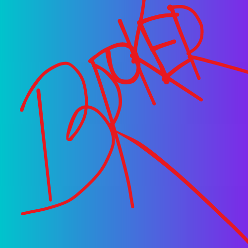

<div align="center">
  
  <h1>Broker</h1>
  <strong>A Object broker for flutter app</strong>
  <h5>Send messages to any widget from anywhere in your flutter app</h5>
</div>
<br>

Broker is a package for Flutter apps that functions as a message broker, allowing you to send messages from anywhere in your app to any widget. With Broker, you only need to initialize the Broker class once, and you can use it anywhere in your app to send messages to widgets both above and below. Additionally, if you have multiple subscribers, Broker supports message broadcasting, making it easy to ensure that all relevant widgets receive the same message

## Features

- A message broker for flutter app
- Send messages to any widget irrespective of there position in widget tree.
- Support message brodcasting.
- Initialize once and use anywhere, use function `getBroker()`.

## Getting started

```dart
import 'package:broker/broker.dart';
```

## Usage

### Step 1

```dart
void main() {
    // initializing Broker once and use it anywhere
    Broker broker = Broker();

    runApp(const MyApp());
}
```

### Step 2

```dart
// I will suggest to put this line in your stateless or statefull class as attribute
late Broker broker;

// I will suggest to put this code in initState() function
broker = getBroker();
broker.register("<subscriber-name>")

broker.listen("<subscriber-name>", (event) {
    Protocol protocol = (event as Protocol);
    print("Message: ${protocol.data}");
})
```

If your are having problem setting up, see [exampe]()
